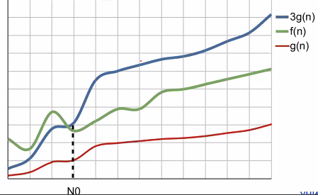
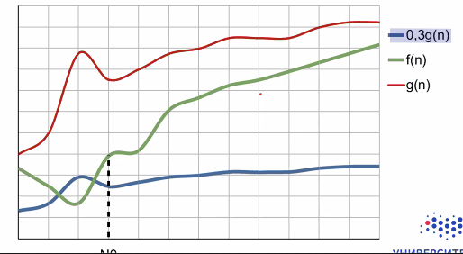

## Lecture 1

Представьте, что:
- браузер загружает страницы и видео в 3-4 раза медленнее обычного
- оплата по кредитной карте в магазине занимает 10-15 минут
- чтобы набрать букву в СМС-ке смартфону требуется 5 секунд
- И т.д. и т.П.
- Вот что может произойти если пользоваться неэффективными алгоритмами!

想象一下：
- 浏览器加载页面和视频的速度比正常情况慢 3-4 倍
- 在店内用信用卡付款需要 10-15 分钟
- 智能手机在短信中输入一个字母需要 5 秒
- 等等。
如果您使用低效算法，就会发生这种情况！

Рассмотрим задачу:
- Время работы алгоритма 1 пропорционально функции f= N2
- Время работы алгоритма 2 пропорционально функции f= NlogN
Есть два компьютера
- Компьютер А выполняет 10° операций в секунду (частота ~ ГГЦ)
- Компьютер Б выполняет 106 операций в секунду (частота ~ МГЦ)

考虑问题：
- 算法 1 的运行时间与函数 $f= N^2$ 成正比
- 算法 2 的运行时间与函数 $f= N\log N$ 成正比
 有两台电脑
- 计算机 A 每秒执行 $10^9$ 操作（频率～GHz）
- 计算机 B 每秒执行 $10^6$ 次操作（频率～MHz）

Мало ядер? Закон Амдала

В каких единицах лучше измерять время работы алгоритма?
- Важно сравнивать алгоритмы между собой
- От чего зависит время работы (реализации) алгоритма?
- От N- мера размера задачи
- От входных данных
- От платформы исполнения
- От языка программирования и компилятора
- Время выполнения ~ число выполненных операций (строк
кода)
- Что такое одна операция?

衡量算法运行时间的最佳单位是什么？
- 相互比较算法很重要
- 什么决定了算法的运行时间（实现）？
- 来自任务大小的 N 度量
- 来自输入
- 从执行平台
- 来自编程语言和编译器
- 执行时间～执行的操作数（代码行数）
- 什么是一次操作？

Какой из алгоритмов лучше?
- f.(N) = 239 x N2 + 30 × N + 566
- fa(N) = 10 x N3
- При маленьких N? При больших N?
- Постоянные множители будут варьироваться в
зависимости от языка программирования, компилятора, архитектуры компьютера...
- f(N) - это какое время?

哪种算法更好？
- f.(N) = 239 x N2 + 30 x N + 566
- fa(N) = 10 x N3

-对于小 N？  对于大 N?
-常数乘数会有所不同，具体取决于
 取决于编程语言、编译器、计算机体系结构……
-f (N) 是什么时间？

```c++
void insertion_sort(int *a, int n)
{
    int i, j, t;
    for (i=1; i < n; ++i) {
        t = a[i];
        j = i;
        while (j > 0 && a[j-1] > t) {
            a[j] = a[j-1];
            --j;
        }
        a[j]=t;
    }
}
```

Инвариант: в начале каждого цикла `for` подмассив `а[0..i-1]` состоит из отсортированных элементов изначального подмассива `а[0..i-1]`  
不变性：在每个 `for` 循环的开始，子数组 `a[0..i-1]` 由原始子数组 `a[0..i-1]` 的排序元素组成

Среднее время работы
- Дает среднее время выполнения при определенных
предположениях о частоте появления того или иного входа
- Требует знания предметной области

Наихудшее время работы
- Дает верхнюю оценку времени выполнения вне зависимости от входных данных
- Не требует знания предметной области
- Позволяет гарантировать время выполнения
- Легче рассчитывается
- Среднее часто ведет себя как наихудшее

平均运行时间
- 在特定输入发生频率的某些假设下给出平均执行时间
- 需要领域知识
最差运行时间
- 无论输入数据如何，都给出执行时间的上限估计
- 不需要领域知识
- 让你保证执行时间
- 更容易计算
- 平均通常表现得像最差的

Пренебрежем постоянными множителями, членами меньшего порядка и сфокусируемся на больших /
- Математически много проще :)
- Непонятно как считать постоянные множители
- На самом деле почти ничего не теряем!
- На маленьких задачах и так все быстро (тут постоянные множители важны!)
- Закон Мура <-> вычислительные потребности

Время работы f() пропорционально:
- $1、\log N、N、N\log N、N^2、N^3、2^N$
- Насколько увеличится $f(N)$ при $N\to2N$?

我们忽略常数因子、低阶项并关注大 N
- 数学上更容易 :)
- 不清楚如何计算常数因子
- 事实上，我们几乎没有损失！
- 在小任务上一切都很快（常数乘数在这里很重要！）
- 摩尔定律 <-> 计算需求

$f()$ 的运行时间正比于：
- $1、\log N、N、N\log N、N^2、N^3、2^N$
- 当 $N\to2N$ 时，$f(N)$ 会增加多少？

Лучший алгоритм ~ наихудшее время работы алгоритма? растет наиболее медленно с увеличением размера входной задачи (т.е. смотрим только на порядок роста)
Цель - линейный рост
Какой из алгоритмов лучше?
- $f_1(N) = 239 x N^2 + 30 \times N + 566$
- $f_2(N) = 10 x N^3$
  - $f_1(30) = 216 566; f_2(30) = 270 000$
  - $f_1(100) = 2 393 566; f_2(100) = 10\ 000\ 000$
  - $f_1(1000) = ???; f_2(1000) = ???$

Что лучше: $N^{100}$ или $2^N$? $N = 1000$?

最佳算法～最差算法时间？  随着输入问题规模的增加，增长最慢（即只看增长顺序）
 目标 - 线性增长
 哪种算法更好？
- $f_1(N) = 239 x N^2 + 30 \times N + 566$
- $f_2(N) = 10 x N^3$
  - $f_1(30) = 216 566; f_2(30) = 270 000$
  - $f_1(100) = 2 393 566; f_2(100) = 10\ 000\ 000$
  - $f_1(1000) = ???; f_2(1000) = ???$

哪个更好：$N^{100}$ 或 $2^N$？ $N = 1000$？

А как нам описать время выполнения безотносительно ко входным данным, а не только в (наихудшем случае?  
我们如何描述执行时间而不考虑输入数据，而不仅仅是（最坏的情况？

О-обозначения: асимптотическая верхняя граница  
Говорим, что $f(N)= O(g(N))$, ecли $\exist c$ и $N_0 > 0$ такие, что $0 \le f(N) \le cg(N)$ для всех $N\ge N_0$



($\Omega$-обозначения: асимптотическая нижняя граница
Говорим, что f(N) = Q(9 (N)), если 3 си N > 0 такие, что 0 5 cg (N) = f(N) для всех N ≥ No
-0,3g(n)



Пусть есть функция f(N) = 239 × N2 + 30 × N + 566
Что верно?
- f(N) = O(N)
- f(N) = O (N2)
- f(N) = 2 (N)
- f(N) = 0 (N2)
- f(N) = O (N3)
Как можно выразить постоянную функцию?  

设函数 f(N) = 239 × N2 + 30 × N + 566
什么是对的？
- f(N) = O(N) -
- f(N) = O(N2) +
- f(N) = 2(N) +
- f(N) = 0 (N2) +
- f(N) = O(N3) +
如何表达一个常量函数？

a f(N) = ax NK + ax-1 NK-1 + ... + agNt ao
• Докажем, что f(N) = O (NK), т.е. можно пренебречь постоянными множителями и членами меньшего порядка
a f(N) = a NK + ax. 1 NK-1 + ... + ag N+ ao ≤
SladNK+|ax-1|NK-1+...+|aj|N+|a0l5
• Возьмем с = lakl + |ax-1l + .. + |ag| + | aol, No = 1, тогда
F(N) ≤ CNK для всех N≥ No

```c++
void insertion_sort(int *a, int n)
{
    int i, j, t;
    for (i=1; i < n; ++i) {
        t = a[i];
        j = i;
        while (j > 0 && a[j-1] > t) {
            a[j] = a[j-1];
            --j;
        }
        a[j]=t;
    }
}
```

T() = O(N2) - верхняя граница для наихудшего случая
T() = Q (N) - нижняя граница для наилучшего случая
Верно ли, что S2 (N2) - время работы в наихудшем случае?