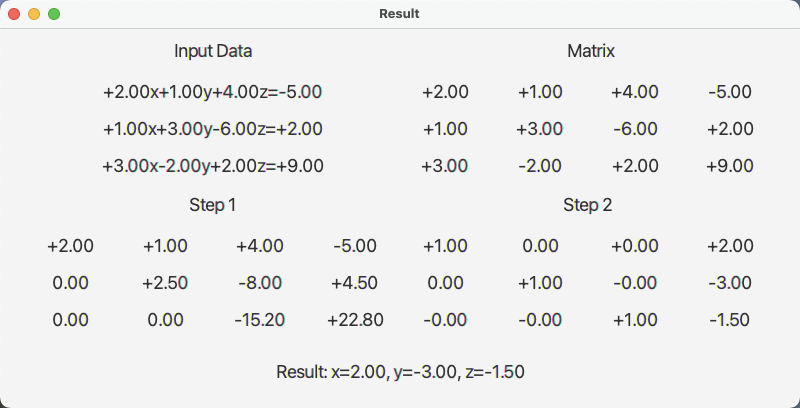
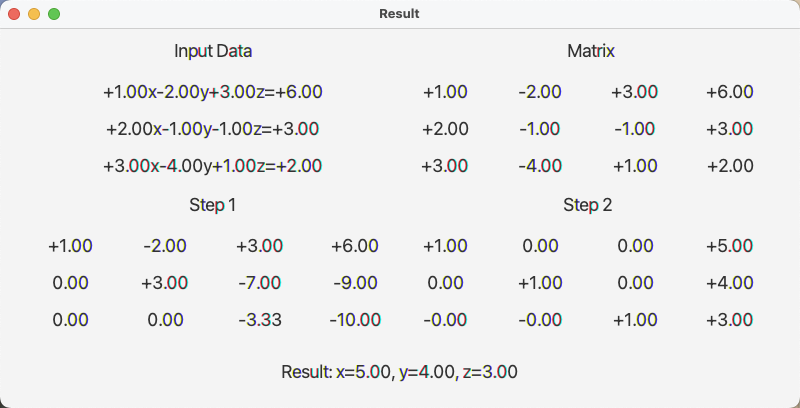
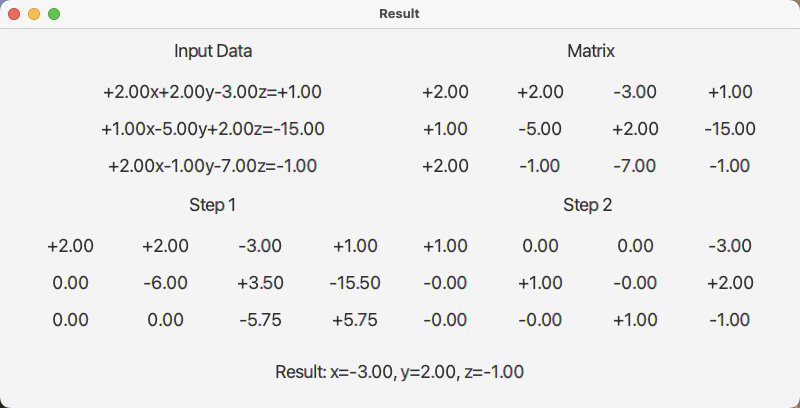
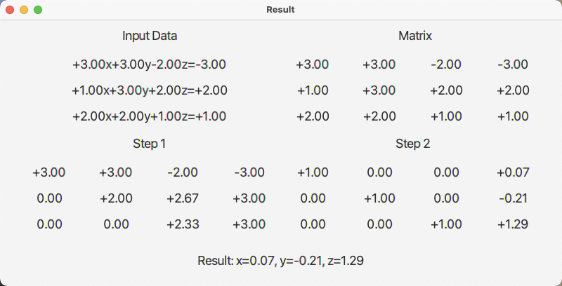

<head>
  <script src="https://cdn.mathjax.org/mathjax/latest/MathJax.js?config=TeX-AMS-MML_HTMLorMML" type="text/javascript"></script>
  <script type="text/x-mathjax-config">
    MathJax.Hub.Config({
      tex2jax: {
      skipTags: ['script', 'noscript', 'style', 'textarea', 'pre'],
      inlineMath: [['$','$']]
      }
    });
  </script>
</head>

## [MainPage](../index.md)/[Mathematics](README.md)/Graphic Work

## Задание 1

Решить СЛАУ методом Гаусса (аналитически) и модифицированным методом Гаусса (ММГ)(посмотрите файл “численные методы”). Реализовать код для алгоритма ММГ и сравнить результаты численного и аналитического подхода.  
通过高斯方法（解析）和修正高斯方法 (ММГ) 求解线性代数方程组（SLAE）参见文件“数值方法”。 实现 ММГ 算法的代码并比较数值和解析方法的结果。

### 1.1

$$\begin{cases}
    3x-2y-3z=0\\
    x+5y+3z=1\\
    2x-3y-4z=3\\
\end{cases}$$


### 1.2

$$\begin{cases}
    2x+y+4z=-5\\
    x+3y-6z=2\\
    3x-2y+2z=9\\
\end{cases}$$



### 1.3

$$\begin{cases}
    x-2y+3z=6\\
    2x-y-z=3\\
    3x-4y+z=2\\
\end{cases}$$



### 1.4

$$\begin{cases}
    2x+2y-3z=1\\
    x-5y+2z=-15\\
    2x-y-7z=-1\\
\end{cases}$$



### 1.5

$$\begin{cases}
    3x+3y-2z=-3\\
    x+3y+2z=2\\
    2x+2y+z=-1\\
\end{cases}$$



main Algorithm:

```Java
double[][] matrixTable = new double[3][4];
double resultX;
double resultY;
double resultZ;

for (int i = 0; i < n - 1; i++) {
    for (int j = i + 1; j < n; j++) {
        double div = matrixTable[j][i]/matrixTable[i][i];
        for (int k = 0; k < n + 1; k++) {
            matrixTable[j][k] = matrixTable[j][k] - div * matrixTable[i][k];
            //matrixTable[j][k] *= matrixTable[i][i];
        }
    }
}

for (int i = n-1; i > 0; i--) {
    for (int j = i-1; j >= 0 ; j--) {
        double div = matrixTable[j][i]/matrixTable[i][i];
        for (int k = 0; k < n + 1; k++) {
            matrixTable[j][k] = matrixTable[j][k] - div * matrixTable[i][k];
            //matrixTable[j][k] *= matrixTable[i][i];
        }
    }
}

for (int i = 0; i < n; i++) {
    double div = matrixTable[i][i];
    for (int j = 0; j < n + 1; j++) {
        matrixTable[i][j] = matrixTable[i][j]/div;
    }
}

resultX = matrixTable[0][3];
resultY = matrixTable[1][3];
resultZ = matrixTable[2][3];
```

View More in [GitHub](https://github.com/Tolia-GH/Semester-2/tree/main/Mathematic/GraphicWork)

Download [Application](https://github.com/Tolia-GH/Semester-2/releases/download/Mathematic/GraphicWork.jar)

## Задание 2

## Задание 3

Разобраться с материалом (пункт 5) и аналогично с приведенными примерами аналитически и численно найти минимумы функции.Сделать график и указать найденную точку.  
处理材料（第 5 点）并类似地处理给出的示例，分析和数值地找到函数的最小值。绘制图表并指出找到的点。

### 3.1

$$z=5x^2+5y^2+6xy-8\sqrt{2}x-8\sqrt{2}y$$

**Аналитическим:**

Для начала найдём частные производные первого порядка:

$$\begin{split}
    \frac{\partial z}{\partial x}&=10x+6y-8\sqrt{2}\\
    \frac{\partial z}{\partial y}&=6x+10y-8\sqrt{2}\\
\end{split}$$

Составим систему уравнений

$$\begin{cases}
    \frac{\partial z}{\partial x}&=0\\
    \frac{\partial z}{\partial y}&=0\\
\end{cases}\Rightarrow
\begin{cases}
    10x+6y-8\sqrt{2}=0\\
    6x+10y-8\sqrt{2}=0\\
\end{cases}
$$

Получим, что:

$$\begin{cases}
    x=\frac{1}{\sqrt{2}}\\
    y=\frac{1}{\sqrt{2}}\\
\end{cases}$$

Теперь найдём частные производные второго порядка:

$$\frac{\partial^2z}{\partial x^2}=10;
\frac{\partial^2z}{\partial y^2}=10;
\frac{\partial^2z}{\partial x\partial y}=6$$

Вычислим значение $\Delta$:

$$\Delta
=\frac{\partial^2z}{\partial x^2}\cdot\frac{\partial^2z}{\partial y^2}-(\frac{\partial^2z}{\partial x\partial y})^2
=10\cdot10-6^2
=64$$

Так как $\Delta>0$ и $\frac{\partial^2z}{\partial x^2}>0$, о согласно алгоритму точка $(\frac{1}{\sqrt{2}},\frac{1}{\sqrt{2}})$ есть точкой минимума функции $z$.

Минимум функции $z$ найдём, подставив в заданную функцию координаты точки $(\frac{1}{\sqrt{2}},\frac{1}{\sqrt{2}})$

$$z_{min}=z(\frac{1}{\sqrt{2}},\frac{1}{\sqrt{2}})=-8$$

### 3.2

$$17x^2+8y^2+12xy-32\sqrt{5}x-16\sqrt{5}y+60$$

**Аналитическим:**

Для начала найдём частные производные первого порядка:

$$\begin{split}
    \frac{\partial z}{\partial x}&=34x+12y-32\sqrt{5}\\
    \frac{\partial z}{\partial y}&=12x+16y-16\sqrt{5}\\
\end{split}$$

Составим систему уравнений

$$\begin{cases}
    \frac{\partial z}{\partial x}&=0\\
    \frac{\partial z}{\partial y}&=0\\
\end{cases}\Rightarrow
\begin{cases}
    34x+12y-32\sqrt{5}=0\\
    12x+16y-16\sqrt{5}=0\\
\end{cases}
$$

Получим, что:

$$\begin{cases}
    x=\frac{4}{\sqrt{5}}\\
    y=\frac{2}{\sqrt{5}}\\
\end{cases}$$

Теперь найдём частные производные второго порядка:

$$\frac{\partial^2z}{\partial x^2}=34;
\frac{\partial^2z}{\partial y^2}=16;
\frac{\partial^2z}{\partial x\partial y}=12$$

Вычислим значение $\Delta$:

$$\Delta
=\frac{\partial^2z}{\partial x^2}\cdot\frac{\partial^2z}{\partial y^2}-(\frac{\partial^2z}{\partial x\partial y})^2
=34\cdot16-12^2
=400$$

Так как $\Delta>0$ и $\frac{\partial^2z}{\partial x^2}>0$, о согласно алгоритму точка $(\frac{4}{\sqrt{5}},\frac{2}{\sqrt{5}})$ есть точкой минимума функции $z$.

Минимум функции $z$ найдём, подставив в заданную функцию координаты точки $(\frac{4}{\sqrt{5}},\frac{2}{\sqrt{5}})$

$$z_{min}=z(\frac{4}{\sqrt{5}},\frac{2}{\sqrt{5}})=-20$$

### 3.3

$$3x^2+3y^2-2xy+8\sqrt{2}x-8\sqrt{2}y$$

**Аналитическим:**

Для начала найдём частные производные первого порядка:

$$\begin{split}
    \frac{\partial z}{\partial x}&=6x-2y+8\sqrt{2}\\
    \frac{\partial z}{\partial y}&=-2x+6y-8\sqrt{2}\\
\end{split}$$

Составим систему уравнений

$$\begin{cases}
    \frac{\partial z}{\partial x}&=0\\
    \frac{\partial z}{\partial y}&=0\\
\end{cases}\Rightarrow
\begin{cases}
    6x-2y+8\sqrt{2}=0\\
    -2x+6y-4\sqrt{2}=0\\
\end{cases}
$$

Получим, что:

$$\begin{cases}
    x=-\sqrt{2}\\
    y=\sqrt{2}\\
\end{cases}$$

Теперь найдём частные производные второго порядка:

$$\frac{\partial^2z}{\partial x^2}=6;
\frac{\partial^2z}{\partial y^2}=6;
\frac{\partial^2z}{\partial x\partial y}=-2$$

Вычислим значение $\Delta$:

$$\Delta
=\frac{\partial^2z}{\partial x^2}\cdot\frac{\partial^2z}{\partial y^2}-(\frac{\partial^2z}{\partial x\partial y})^2
=32$$

Так как $\Delta>0$ и $\frac{\partial^2z}{\partial x^2}>0$, о согласно алгоритму точка $(-\sqrt{2},\sqrt{2})$ есть точкой минимума функции $z$.

Минимум функции $z$ найдём, подставив в заданную функцию координаты точки $(-\sqrt{2},\sqrt{2})$

$$z_{min}=z(-\sqrt{2},\sqrt{2})=$$

### 3.4

$$13x^2+37y^2+18xy-16\sqrt{10}x-48\sqrt{10}y+120$$

**Аналитическим:**

Для начала найдём частные производные первого порядка:

$$\begin{split}
    \frac{\partial z}{\partial x}&=26x+18y-16\sqrt{10}\\
    \frac{\partial z}{\partial y}&=18x+74y-48\sqrt{10}\\
\end{split}$$

Составим систему уравнений

$$\begin{cases}
    \frac{\partial z}{\partial x}&=0\\
    \frac{\partial z}{\partial y}&=0\\
\end{cases}\Rightarrow
\begin{cases}
    26x+18y-16\sqrt{10}=0\\
    18x+74y-48\sqrt{10}=0\\
\end{cases}
$$

Получим, что:

$$\begin{cases}
    x=\sqrt{\frac{2}{5}}\\
    y=3\sqrt{\frac{2}{5}}\\
\end{cases}$$

Теперь найдём частные производные второго порядка:

$$\frac{\partial^2z}{\partial x^2}=26;
\frac{\partial^2z}{\partial y^2}=74;
\frac{\partial^2z}{\partial x\partial y}=18$$

Вычислим значение $\Delta$:

$$\Delta
=\frac{\partial^2z}{\partial x^2}\cdot\frac{\partial^2z}{\partial y^2}-(\frac{\partial^2z}{\partial x\partial y})^2
=1600$$

Так как $\Delta>0$ и $\frac{\partial^2z}{\partial x^2}>0$, о согласно алгоритму точка $(\sqrt{\frac{2}{5}},3\sqrt{\frac{2}{5}})$ есть точкой минимума функции $z$.

Минимум функции $z$ найдём, подставив в заданную функцию координаты точки $(\sqrt{\frac{2}{5}},3\sqrt{\frac{2}{5}})$

$$z_{min}=z(\sqrt{\frac{2}{5}},3\sqrt{\frac{2}{5}})=-40$$

### 3.5

$$4x^2+4y^2-10xy-27\sqrt{2}x+27\sqrt{2}y+72$$

**Аналитическим:**

Для начала найдём частные производные первого порядка:

$$\begin{split}
    \frac{\partial z}{\partial x}&=8x-10y-27\sqrt{2}\\
    \frac{\partial z}{\partial y}&=-10x+8y+27\sqrt{2}\\
\end{split}$$

Составим систему уравнений

$$\begin{cases}
    \frac{\partial z}{\partial x}&=0\\
    \frac{\partial z}{\partial y}&=0\\
\end{cases}\Rightarrow
\begin{cases}
    8x-10y-27\sqrt{2}=0\\
    -10x+8y+27\sqrt{2}=0\\
\end{cases}
$$

Получим, что:

$$\begin{cases}
    x=-\frac{27}{41\sqrt{2}}\\
    y=-\frac{243}{41\sqrt{2}}\\
\end{cases}$$

Теперь найдём частные производные второго порядка:

$$\frac{\partial^2z}{\partial x^2}=8;
\frac{\partial^2z}{\partial y^2}=8;
\frac{\partial^2z}{\partial x\partial y}=-10$$

Вычислим значение $\Delta$:

$$\Delta
=\frac{\partial^2z}{\partial x^2}\cdot\frac{\partial^2z}{\partial y^2}-(\frac{\partial^2z}{\partial x\partial y})^2
=-36$$

Так как $\Delta<0$ и $\frac{\partial^2z}{\partial x^2}>0$, то в расматриваемой стационарной точке экстремума нет.

$z_{min}$ нет

main Algorithm:

```python
import numpy as np


def f(x):  # Define the objective function
    return x[0]**2/2 + x[0]*x[1] + x[1]**2 - 2*x[1]


A = np.array(([1/2, 1/2], [1/2, 1]), dtype=float)
b = np.array([0., 2.])


eigs = np.linalg.eigvals(A)
print("The eigenvalues of A:", eigs)

if (np.all(eigs>0)):
    print("A is positive definite")
elif (np.all(eigs>=0)):
    print("A is positive semi-definite")
else:
    print("A is negative definite")


if (A.T==A).all()==True: print("A is symmetric")


def linear_CG(x, A, b, epsilon):
    res = A.dot(x) - b  # Initialize the residual
    delta = -res  # Initialize the descent direction

    while True:

        if np.linalg.norm(res) <= epsilon:
            return x, f(x)  # Return the minimizer x* and the function value f(x*)

        D = A.dot(delta)
        beta = -(res.dot(delta)) / (delta.dot(D))  # Line (11) in the algorithm
        x = x + beta * delta  # Generate the new iterate

        res = A.dot(x) - b  # generate the new residual
        chi = res.dot(D) / (delta.dot(D))  # Line (14) in the algorithm
        delta = chi * delta - res  # Generate the new descent direction


linear_CG(np.array([2.3, -2.2]), A, b, 10**-5)
```

## Задание 4