## [MainPage](../index.md)/[OPD](README.md)/part1

## 操作系统

- 含义：这个术语通常意味着“软件+固件”，他们深入了解硬件，并利用和控制硬件。 “操作系统”实现了某些原语，这些原语能够被软件（通常称为中间件和应用程序）所使用。在我看来，随着一个操作系统的成长，他们都趋向一种相似的最小化的功能组合，并且位于硬件之上。这种函数可能仅仅是位于“应用程序”和硬件之间的层，或者它可以虚拟化硬件，或虚拟化硬件和应用程序
- 作用：将程序和数据加载到内存中，控制程序的执行，并以人类可理解的形式提供工作结果，并且提供同时执行多个程序的能力
- 分类
  - 个人操作系统：主要目标为个人用户提使用计算系统的便利
  - 服务器：只在处理来自其它系统的大量请求
  - 嵌入式系统：其目的是支持计算系统，传感器，信号转换器和其它设备的硬件功能，例如飞机，航天器，信号，洗衣机等其他包含是计算机的硬件
- 构成：操作系统包含系统内核与用户程序的环境（库，文件）
  - 内核
      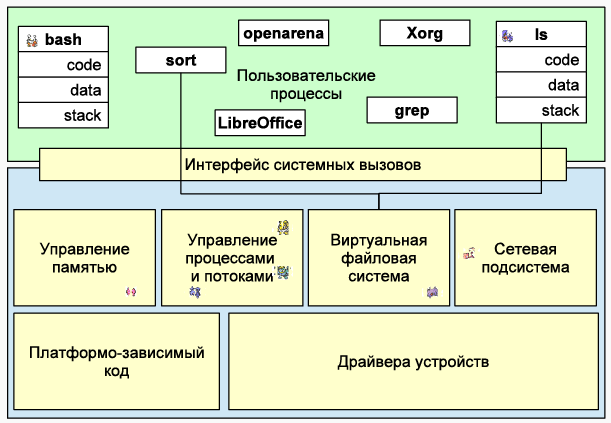
    - 内核是一组管理用户硬件和程序的子系统。对任何操作系统都至关重要的主要子系统是内存管理、进程和线程管理（负责在一个操作系统上同时执行多个程序）、虚拟文件系统（从操作系统的角度来看，数据交换是使用文件组织的）在 UNIX 中，一切都是文件）、网络子系统、设备驱动程序和特定于平台的代码（支持系统在各种硬件架构上运行的驱动程序）。用户程序通过系统调用接口与内核交互
    - 从用户的角度来看，任何可执行程序都是一个地址空间，它在逻辑上和物理上被划分为几个段。例如，程序本身执行的代码段，运行所需数据所在的数据段，堆栈段，用于存储返回地址和将参数传递给子程序。除了这些主要段之外，还使用堆或堆、共享库段、内存映射文件，即直接映射到进程地址空间的文件等。所有这些段共同构成了在操作系统内部运行并与之交互的进程映像
    - 此外，程序可以使用内核和系统调用接口相互交互。系统调用接口是进程与内核通信的一种标准化方式，用户进程只能通过该接口访问内核服务。
  - 操作环境：这个术语通常描述了一个体系结构框架的组合，有着一些“中间件”功能的应用程序运行在这个体系结构框架之上。这比“纯粹的”硬件实现和/或虚拟化要更高一个层次或者 2 个。操作环境提供了，例如 —— 一组特定的连接到数据库的接口，Web环境，等等。 这显然不是仅仅对硬件的抽象，而是一个系统的软件结构，但并没有直接的硬件实现

### 文件系统
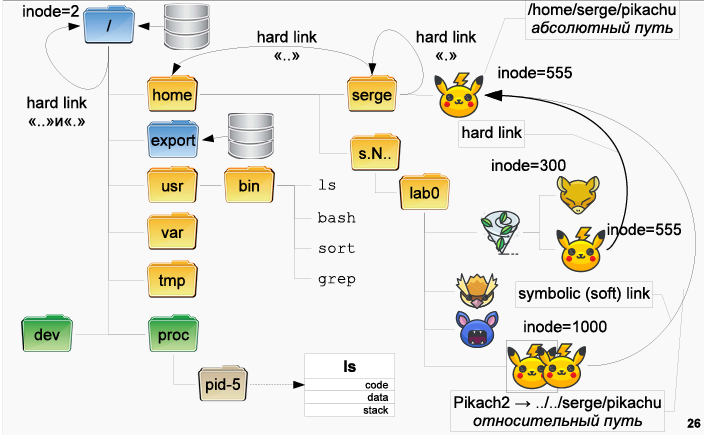
- 文件
  - 概念：UNIX 下一切皆文件，文件时整个文件系统的基础
  - 内容：其中存储所有必要的系统和用户信息
  - 信息
    1. 文件的类型和权限
         
        - 以 10 位字符表示
        - 第 1 位表示文件类型
          - `-` 常规文件：这包括所有本身就是有价值信息的数据文件
          - `d` 目录：这些文件的数据里记录了其包含的文件和目录的列表。在目录数据中，文件名（可以理解为名称）与其 inode（身份证号）相关联。因此，同一个文件可以存在不同的名称和/或不同的目录中，但所有名称都将与同一个 inode 相关联（硬链接机制）
          - `l` 链接文件：是一个文件，其数据包含通过其名称（但不是通过 inode）指示另一个文件的地址
          - `b` 装置文件里面的可供储存的接口设备（可随机存取装置）
          - `c` 装置文件里面的串行端口设备，例如键盘、鼠标（一次性读取装置）
          - `s` 域套间字（socket）
          - `p` 管道
        - 第 2-4 位表示所有者权限，用 `rwx` 分别表示读，写，执行权限，没有的权限用 `-`表示
        - 第 5-7 位表示所有组权限，表示格式同上
        - 第 8-10 位表示其他用户权限，表示格式同上
    2. 文件的硬连接数
    3. 所有者名称
    4. 所有者组名称
    5. 文件大小（以字节为单位）
    6. 修改时间（默认最后一次修改时间）
- 目录
  - 本质：一种特殊的文件
  - 内容：
    - 作为文件其中存储了所包含的文件名和 inode 号
    - 每个目录都包含两个必须的文件
      - "."文件 - 指向自身的链接
      - ".."文件 - 指向文件层次结构更高的目录的链接
  - 权限
    - `r` 可列出目录中的文件或者是目录情况
    - `w` 可在目录中创建、删除和修改命令下的文件或者是目录
    `x` 可以使用cd命令切换到此目录
    `-` 没有任何此目录的所有权限
  - 常见系统目录
    - `/usr/bin` - 操作系统提供的主要实用程序和程序目录
    - `/usr/lib` - 系统库目录
    - `/var` - 系统日志和工作文件目录
    - `/tmp` - 临时存储目录
    - `/proc` - 包含表示有关用户和操作系统进程的信息的文件目录
  - 路径
    - 绝对路径：从文件系统根目录开始的路径
    - 相对路径：是从当前目录开始的路径
  - 链接：在 UNIX 系统中使用链接可以将相同的文件放在不同的目录中。Linux 中有两种类型的文件链接。这些是 Linux 符号链接和硬链接
    - 硬链接：与原文件具有相同 inode （在同一个挂载点内）的文件，这种类型的链接在文件系统的较低级别实现。该文件仅位于硬盘驱动器上的特定位置。但是这个地方可以被文件系统中的几个链接引用。每个链接都是一个单独的文件，但它们指向硬盘的同一区域。该文件可以在目录之间移动，并且所有链接都将继续工作，因为名称对它们来说并不重要
      - 特点：
        - 只能在同一个文件系统内工作
        - 目录不能被引用
        - **具有与源文件相同的 inode 信息和权限集**
        - 当文件的权限更改时，链接的权限会更改
        - 您可以在不损害链接的情况下移动和重命名甚至删除文件
        - 如果您更改其中一个文件的权限，则会更改另一个文件的权限
    - 软连接（符号链接）：与快捷方式类似，包含原文件绝对路径或相对路径的文件，当您尝试打开此类链接时，将打开目标文件或文件夹。它与硬链接的主要区别在于，当目标文件被删除时，链接将保留，但它不会指向任何地方，因为文件实际上已不存在
      - 特点：
        - 可以引用文件和目录；
        - 删除、移动或重命名文件后失效
        - **访问权限和 inode 编号与源文件不同**
        - 如果更改源文件的权限，链接的权限将保持不变
        - 可以参考其他磁盘分区
        - 仅包含文件名，不包含其内容
        - 如果一个文件有多个硬链接，那么只有当指向它的 inode 的最后一个链接被删除并且链接计数被重置为 0 时，它才会被删除
    - ln 指令
      - 用法：`ln [参数] 原文件 链接文件`
      - 参数：
        - `d` 允许超级用户为目录创建硬链接
        - `f` 删除现有链接
        - `i` 询问是否应该删除现有链接
        - `P` 创建一个硬链接
        - `s` 创建一个符号链接
        - `r` 创建一个带有文件相对路径的符号链接
    - 注意：您不能根据 POSIX（由 ISO 委员会开发的一组标准）创建指向目录的硬链接，因为在创建目录的硬链接时，访问父文件夹时会有歧义，因为会有几个，加上递归搜索可能会产生死循环，所以禁止创建硬链接
- 标准流
    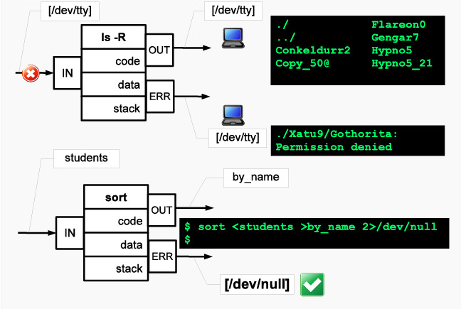
  - 标准输入流（`stdin`(0)）：输入至程序的资料（通常是文件）
  - 标准输出流（`stdout`(1)）：自程序输出的资料
  - 标准错误流（`stderr`(2)）：输出流的一种，子程序输出的错误信息，与标准输出区分

### 指令系统

- 环境与环境变量
  - 系统为每个正在运行的进程提供一定的信息空间，该进程有权随意更改。使用这个空间的规则很简单：您可以在其中设置命名数据存储（环境变量），您可以在其中写入任何信息（分配环境变量的值），然后读取此信息（替换多变的）
  - 每个过程都有参数和环境。进程参数是一个以 `null` 结尾的字符串数组，通常称为 `argv`，并传递给第一个调用的函数。参数的数量称为 `argc`。进程的环境是一个 `VARIABLE = value` 类型的字符串数组，也由 `null` 结尾，并且可以通过全局变量 `environ` 访问，该变量是（在 C 中）类型为 `char` 的。您可以使用 `printenv [name]` 命令查看环境（如果未指定名称，则显示整个环境）
  - 环境变量：环境变量是命名变量，其中包含运行程序可以使用的文本信息。此类变量可以包含一般系统设置、图形或命令 shell 选项、用户偏好数据等
  - 一些重要的变量
    - `PATH` 系统查找可执行文件的目录列表，当 `ls`、`rc-update` 或 `emerge` 等普通命令被 shell（如bash 或zsh）解释时，shell 在此列表中查找具有指定名称的可执行文件，如果找到，则执行文件，将指定的命令行参数传递给它。而要想运行不在 `PATH` 中的可执行文件，则必须指定文件的完整路径
    - `HOME` 当前用户主目录的路径。应用程序可以使用此变量来定位运行它们的用户的设置文件
    - `PWD` 工作目录的路径
    - `OLDPWD` 上一个工作目录的路径，即最后一次 cd 调用之前 PWD 的值
    - `SHELL` 当前 shell 的名称，例如 bash
    - `TERM` 正在运行的终端程序的名称，例如 xterm
    - `PARGER` 指定运行文本文件分页程序的命令，例如 /bin/less
    - `EDITOR` 运行用于编辑文本文件的程序的命令，例如 /usr/bin/nano。您还可以指定一个特殊的命令，该命令将根据环境选择编辑器，例如 X 中的 gedit 或 nano 终端
    - `MANPATH` `man` 用于查找手册页的目录列表。默认值为 `/usr/share/man:/usr/local/share/man`
    - `TZ` 可用于设置时区。可以在 /usr/share/zoneinfo/ 中找到可用的时区
  - 变量设置
    - 大多数 Linux 发行版都建议在 /etc/profile 或其他地方更改或添加环境变量。请记住，许多文件可以同时包含环境变量并覆盖它们。本质上，可以使用任何脚本来执行此操作，但是，根据 UNIX 约定，只能使用某些文件来执行此操作
    - 以下文件应用于设置系统级环境变量：/etc/profile、/etc/bash.bashrc 和 /etc/environment。这些文件中的每一个都有其局限性，因此您应该仔细选择适合您目的的文件
      - /etc/profile 仅为 shell 设置变量。它可以在 Bourne shell 兼容的 shell 中运行任何脚本
      - /etc/bash.bashrc 仅为交互式 shell 设置变量。它还运行 bash 脚本
      - /etc/environment 由 PAM-env 模块使用。此处只能指定名称=值对
    - 在用户层面设置
      - 您并不总是需要在系统级别设置环境变量。例如，您打算将 `/home/user/bin` 目录添加到 `PATH`，但您不希望系统上的其他用户受到影响。用户环境变量可以在许多其他文件中设置
      - Shell 初始化文件，例如
      - `~/.profile` 也被许多 shell 使用，
      - `~/.pam_environment` 是 PAM-env 模块使用的 `/etc/environment` 的自定义版本。有关详细信息，请参阅 pam_env(8)
      - 例如，要将目录添加到 `PATH`，请将以下内容放入 `~/.bash_profile`
- 信号
  - 概念：在现代操作系统中，有进程间通信（Inter-Process Communication - IPC）的概念——这是一组用于在进程和/或线程之间交换数据的方法。信号就是这样一种交换方法
  - 作用：信号能够在随机时间（异步）中断进程以处理某些事件。一个进程可以被另一个进程或内核发起的信号中断。内核使用信号来通知进程各种事件，例如子进程的终止
  - 实现
    - 在信号出现时立即中断进程并开始处理它
    - 设置一个标志，然后将控制权转移给处理程序，这样信号处理内部的信号出现就不会出现问题
  - 常见信号：
    - `SIGINT（编号2）` 如果终端用户已发出终止进程的命令（通常此命令是键盘快捷键Ctrl-C ），则该信号通常会发送到进程
    - `SIGABRT（编号 6）`作为调用 abort(3) 函数的结果发送到程序。结果，程序以将内存映像保存在磁盘上结束
    - `SIGKILL（数字 9`）`终止程序。程序既不能处理也不能忽略这个信号
    - `SIGSEGV （编号 11）`被发送到试图访问不属于它的内存区域的进程。如果未安装信号处理程序，则程序将退出，并将内存映像保存到磁盘
    - `SIGTERM （数字 15）`导致程序礼貌地终止。收到这个信号后，程序可以在完成前执行必要的操作（例如，释放占用的资源）。收到 SIGTERM 并不表示程序有错误，而是操作系统或用户希望终止它
    - 如果子进程已终止或挂起，则将 `SIGCHLD（编号 17）`发送给进程。如果父进程设置了子进程的信号跟踪模式并且子进程收到了任何信号，父进程也会收到这个信号。默认情况下，SIGCHLD 信号被忽略
    - `SIGCONT （编号 18）`恢复执行由 SIGSTOP 信号停止的进程
    - `SIGSTOP （编号 19）`暂停进程的执行。像 SIGKILL 一样，这个信号不能被捕获或忽略
    - `SIGTSTP （编号 20）`根据用户的命令（通常该命令是键盘快捷键 Ctrl-Z）暂停进程
    - `SIGIO / SIGPOLL（在 Linux 中，两个常量都代表一个信号 - 数字 29）`告诉进程数据已经出现在异步打开的句柄之一上。默认情况下，终止程序
  > 有关系统信号的[更多信息](https://www.ibm.com/developerworks/ru/library/l-signals_1/index.html)
- 命令行参数
  - 概念：shell 最重要的特性之一是处理命令行的能力。当您在 shell 提示符后键入命令并按 Enter 键时，shell 会继续处理命令行，将其拆分为 arguments 。在处理命令行时，shell 可以对您传递的参数进行许多更改。这个过程称为 shell 命令扩展。在 shell 完成对传递的命令字符串的处理和修改后，将直接执行生成的命令。而在调用程序时，数据会从命令行传输到程序。此类数据称为命令行参数
  - 当从命令行调用程序时，总是会传递一对数据给它：
    - 一个整数，表示调用时命令行上的单词数（由空格分隔的元素）
    - 指向字符串数组的指针，其中每个字符串都是命令行中的一个单词
- 常用快捷键
  - Ctrl + C - 使终端向当前控制它的进程发送一个 `SIGINT` 信号。当前台程序收到 `SIGINT` 信号时，它必须中止
  - Ctrl + D - 告诉终端注册所谓的 EOF（文件结束 - 文件结束），即输入流结束。Bash 将此解释为希望退出程序
  - Ctrl + Z - 向进程发送一个信号，告诉它停止。这意味着该进程仍保留在系统中，但可以说是被冻结了。不用说，他进入了背景（背景）——在背景中。使用 `bg` 命令，您可以再次启动它，同时将其留在后台。`fg` 命令不仅恢复了先前挂起的进程，而且还把它从后台带到了前台
- 输入输出重定向
  - `> file` 将标准输出流重定向至 file 文件并覆盖
  - `>> file` 将标准输出流重定向至 file 文件并在其后添加
  - `2> file` 将标准错误流重定向至 file 文件并覆盖
  - `2>> file` 将标准错误流重定向至 file 文件并在其后添加
  - `< file` 将 file 文件的内容重定向至标准输入
  - `<< EOF` 将后续从终端连续输入直到 "EOF" 的内容重定向至标准输入流
  - `|` 管道符，将上一个命令的标准输出链接到下一个命令的标准输入
- 基础命令
  - `mkdir` 创建目录
    - 用法 `mkdir [参数] 目录名`
    - 参数
      - `-p` 若路径中的某些目录尚不存在，加上此选项后，系统将自动建立好那些尚不存在的目录，即一次可以建立多级目录
      - `-m` 创建目录的同时设定权限（类似 `chmod`）
      - `-v` 创建目录后显示信息
  - `echo` 
    - 用法 `echo [参数] [字符串]`
    - 参数
      - `-n` 不在最后自动换行
      - `-e` 对于以下字符加以处理
        - `\a` 发出警告声
        - `\b` 删除前一个字符
        - `\c` 最后不加上换行符号
        - `\f` 换行但光标仍旧停留在原来的位置
        - `\n` 换行且光标移至行首
        - `\r` 光标移至行首，但不换行
        - `\t` 插入tab
        - `\v` 插入垂直表格跳位键
        - `\\` 插入\字符
        - `\nnn` 插入 nnn（八进制）所代表的 ASCII 字符
    - 字符串
      - 可以不带引号输入，此时将忽略字符串中的空格
      - 若带引号输入，则保留引号中字符串包含的空格
  - `cat` 连接文件或标准输入并打印。这个命令常用来显示文件内容，或者将几个文件连接起来显示，或者从标准输入读取内容并显示
    - 用法 `cat [参数] 文件`
    - 参数
      - `-n` 对输出的所有行编号
  - `touch` 用来修改文件时间戳，或者新建一个不存在的文件
    - 用法 `touch [参数] 文件`
    - 参数
      - `-a` 只更改存取时间
      - `-m` 之更改变动时间
  - `ls` 列出目标目录中所有的子目录和文件
    - 用法 `ls [参数] 目录名`
    - 参数
      - `-a` 列出目录下的所有文件，包括以 `.` 开头的隐含文件
      - `-A` 同 `-a`，但不列出 `.` 及 `..` 文件
      - `-S` 根据文件大小排序
      - `-s` 以块大小为单位列出所有文件的大小
      - `-R` 同时列出所有的子目录内容
      - `-r` 以相反次序排列
      - `-l` 以长格式列出文件的详细信息
      - `-t` 以文件修改时间排序，新的在前
  - `pwd` 显示当前目录
  - `cd` 移动至指定目录
  - `rm` 删除指定文件
    - 用法 `rm [参数] 文件地址`
    - 参数
      - `-i` 删除前逐一确认
      - `-f` 强制删除，无需确认
      - `r` 递归删除目录及目录一下的文件
  - `rmdir` 删除空目录
  - `mv` 用来移动文件或者将文件改名
    - 用法 `mv [参数] 原文件 目标文件`
    - 参数
      - `-b` 如果目标文件存在，则在覆盖之前备份
      - `-f` 强制移动，若目标文件存在则直接覆盖
      - `-i` 若目标文件存在，则询问是否覆盖
      - `-u` 若目标文件已经存在，且原文件较新，则会更新
  - `head` 用来显示档案的开头
    - 用法 `mv [参数] 文件`
    - 参数
      - `-q` 隐藏文件名
      - `-v` 显示文件名
      - `-c` 设定显示字节数
      - `-n` 设定显示行数
  - `tail`用来显示档案的结尾
  - `sort` 排序命令
    - 用法 `sort [参数] 文件`
    - 原理：将每一行为单位，互相比较，按 ASCII 码值进行比较，默认以升序输出
    - 参数
      - `-r` 将默认的升序改为降序
      - `-u` 在输出中去除重复行
      - `-o` 把结果输出写入到指定文件，例如将文件内容排序后写入到原来的文件，此时不能用重定向，只能用该参数
      - `-n` 按数字大小排序
      - `-t` 设定列分隔符 默认以空格分列
      - `-k` 按指定列排序
  - `grep`
    - 参数
      - `-l` 仅输出匹配的内容匹配的文件名
      - `-n` 显示符合样式的那一行之前，标示出该行的列数编号
      - `-o` 只显示匹配 PATTERN 部分
      - `-s` 不显示错误信息
  - `wc` 计算文件的字节数，字数或列数
    - 参数
      - `-c` 只显示字节数
      - `-l` 只显示行数
      - `-w` 只显示字数
> 有关命令的[更多信息](https://docs.google.com/document/u/0/d/1Bc6oI4yNCBIUSL9HYmv4jfmCJZzMQJRaJLEnP4KGhTY/mobilebasic)

## 微机原理

### 模拟计算机
- 随着科技和技术的发展，人们构建了能够确定各种物理量的装置，例如速度、加速度、距离。例如，如果我们要测量飞机的高度，那么我们可以测量大气压力或向地面发送电磁脉冲并计算反射信号何时到达。但是物理值本身，例如身高，很难以其自然形式用于进一步的计算，人们想出了用相似值或简单的类似值代替它们的想法。
在现代计算技术中，电压值被用作模拟值。
- 一个模拟量总是连续的，它的行为完全复制了相应物理量的行为。现在，使用这个模拟值，您可以进行计算 - 加、减、微分。例如，当改变高度时，您可以计算相对于表面的垂直速度
- 将物理量转换为模拟量并不总是那么容易，反之亦然。例如，一个人只能区分有限数量的颜色。因此，如果你把两个接近的颜色放在一起，有人会注意到差异，也有人不会注意到。同样的事情也发生在模拟计算中。为了区分飞行飞机的 200m 或 201m 高度，必须有足够准确的仪器来响应信号变化
- 模拟系统仍然广泛用于实时系统、各种测量设备以及信息和控制系统中。因为它们对于某类任务具有非常高的性能和令人满意的计算误差。这是因为模拟值是连续的
- 模拟计算机的积分和微分运算比数字计算机快得多

### 数字计算机

- 模拟计算机计算精度不足的问题导致了数字计算机的创建。决定不再使用精确区分 0.001 伏电压幅度大小的复杂设备，而是使用只有两种状态（0 或 1）的信号更容易。这大大简化了计算机的设计
- 需要记住的是，在计算机内部传输过程中，信号形状可能会失真，如果信号严重失真，则可能会出现错误。这种情况经常发生，但人们通常看不到这一点，因为有特殊的软件和硬件解决方案可以最大限度地减少这些错误。使用内存和传输数据时经常会出现错误
- 数字计算机中的单独脉冲组合成组，允许您以一个或多个数字的形式在代码包中编码信息。数字表示极大地简化了构建计算机的必要元素
- 在最低逻辑级别，计算机由执行逻辑功能的逻辑元素组成
  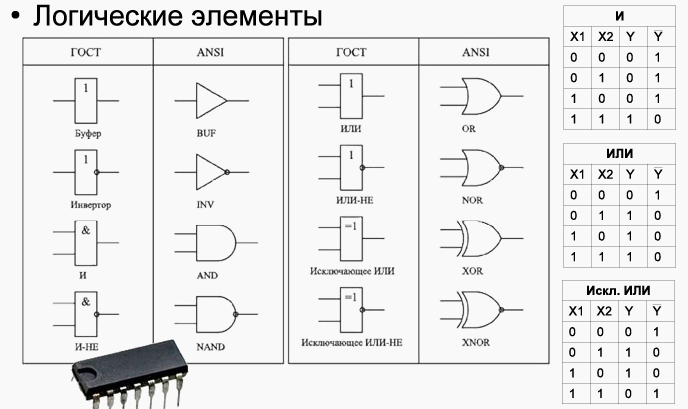
### 数据存储

- 为了在计算机中存储信息和数据，使用 RAM，在计算机打开时存储信息
- 分类
   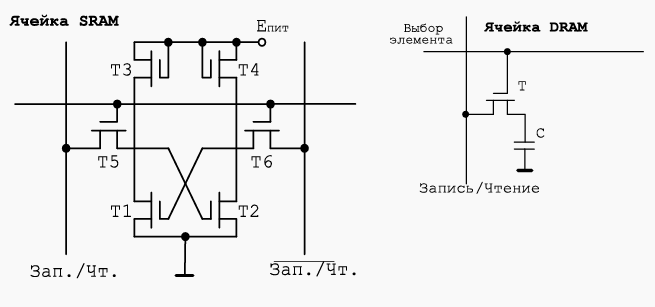
  - 动态存储（DRAM）:
    - 在 DRAM 中，信息存储在晶体管充电电路中的电容中。
    - 一个存储单元由一个晶体管和一个电容器组成（右图）。
    - 这种存储器的缺点是容量逐渐耗尽，因此信息丢失。
    - 为了保持电容上的电荷，提供了一个内存再生装置：计算机在一定时间内（64 ms）扫描所有可用的 RAM 并读取每个单元格，恢复电容上的电荷。 DRAM 的优势在于每单位存储信息的成本低廉，因为一位晶体管只使用一个晶体管
  - 静态存储（SRAM）
    - 由于单元设计，静态 SRAM 不需要重新生成，其中六个晶体管组合在一个电路中，通过反馈电路自我维持其状态。但是，这种内存的价格会更高，而且这种类型的单元更快。基于它们构建内存，通常内置在处理器中。
    - 这种存储器包括例如各种级别的高速缓冲存储器
- 触发器：从建立在逻辑元素上的计算机电路的角度来看，触发器被用作信息存储。触发器 = “锁存器”，您可以使用它来存储和管理信息
    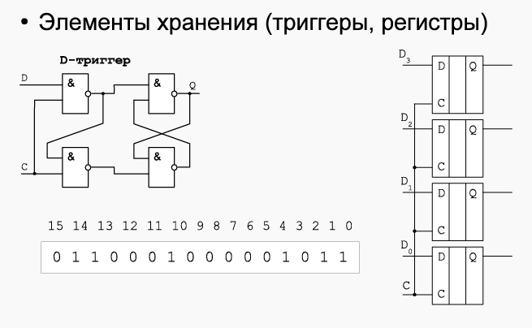
    - 幻灯片左上角显示了最简单的 D 触发器电路。触发器有 2 个输入。其中之一是 D 是信息性的，它提供了需要存储的值，而 C 是同步输入，它决定是否将信息输入处的值写入触发器。
    - 当C=0时，触发器中不存储任何值，输出Q的值将保持不变，即触发器存储之前写入的信息。如果 C=1，则触发器将从信息输入 D 中获取值，并将其存储在其存储方案中。输出 Q 将等于输入 D。
    - 当从输入 C 移除单个信号时，触发器将锁存，输入 D 处的值不会影响触发器 Q 输出处的信号
    - 幻灯片的右侧显示了一个存储 4 位信息的寄存器。有一个公共输入 C，对于所有触发器都是相同的。当对它应用 1 时，同时所有信息都将适合存储单元。数据将无限期地存储在那里，直到您决定用任何其他信息替换它
  - 因此，寄存器形成信息的中间存储。我们将用矩形指定寄存器，如幻灯片左下角所示。该寄存器是 16 位的，即它包含 2 个字节或 2 个字

### 数据传输
- 信息的传输是使用组合成总线的传输线（或电线）进行的。上一张幻灯片中显示的四位寄存器将需要 4 条信息 (D0-D3)、一条控制 (C) 和一条公共（“地”）数据传输线，来自所有电线的电流以相反的方向流过信息信号。因此，要传输 4 位信息，至少需要 6 根线

- 在计算机中，信息不仅必须被存储，而且还必须从一个寄存器传输到另一个寄存器
- 长距离传输信息时，会出现传输错误。这是因为电线形成了相互影响的电磁场。此外，电子设备的广泛使用对通信线路产生了大量的外部干扰。为了最大限度地减少干扰，他们拒绝使用公共线并将信号沿其进入双绞线的正向和反向线绞合。在双绞线中，感应干扰相互抵消，因为干扰是同时在信号的正向和反向导体上感应的。
在图中，总线将由宽导体指示
  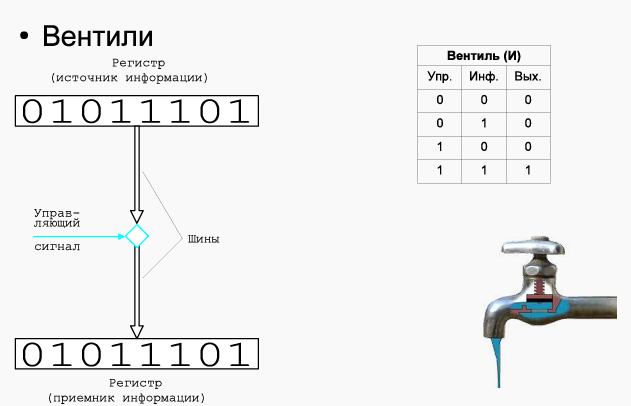

- 信息的传输通常不需要连续进行，而是在严格规定的（由时钟发生器）时间进行。为此，提供了一种称为阀门的逻辑装置，其根据众所周知的起重机的原理工作。阀门可以处于打开状态，然后从一个寄存器输出的信息转到另一个，或者处于关闭状态，则信息传输被阻塞。单逻辑阀门的功能由“与”执行“ 功能
- 阀门具有控制和信息信号。在其输出端，只有当信息和控制信号等于 1（水龙头打开且水流）时，该单元才会运行。如果水龙头打开，但没有水流出，则输出将为 0。在家用水龙头中，这种情况发生在夏季关闭热水时。因此，控制信号允许或禁止信息的传输
- 在我们的功能图中，我们将用菱形表示门

### 算数与逻辑运算
  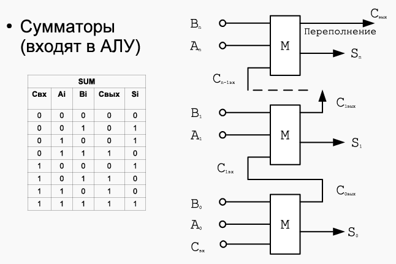
- 计算机不仅仅是传输和存储数据。它还必须对它们执行各种算术或逻辑运算
- 例如，使用加法器（包含在 ALU 中）执行最简单的操作之一 - 加法和减法。
  - 在一般情况下，要添加多位二进制数的 2 位，逻辑元素必须有 3 个输入 - 两个用于项的位的值，另外一个用于从前一位和两个输出 - 用于总和的值和传出进位。在对前面的数字求和后，进位被转移到下一个数字（类似于列加法）
  - 注意图表。它只是显示有数字 A 和 B 以及传入的进位。因此，加法的结果用 S 表示，我们必须将按位转移 Cj 从一个元素的输出转移到下一个元素的输入。那些。多少位数，这么多按位传输的传输应该是多少。如果从高位开始逐位传输，则检测到溢出或溢出。
  - 因此，加法器的问题之一是两个 16 位数字相加会产生一个 17 位数字。另一个问题是，当添加每个下一位的值取决于前一位时，这会导致性能下降。如果一个元素的响应速度等于 Vs，那么 16 位串行按位加法器的加法速度将为 16 * Vs

### 周期
- 时钟周期
    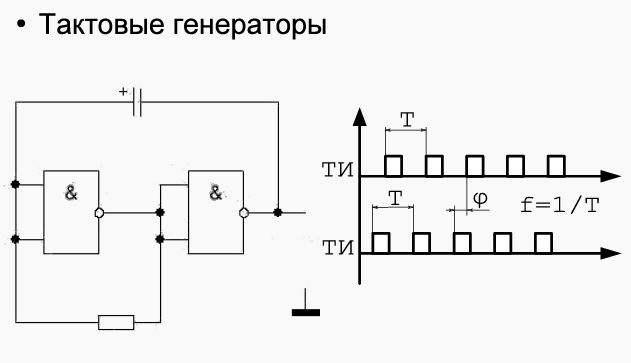
  - 时钟发生器是计算机的“心脏”。就像人的心脏一样，它们设定了整个计算机的节奏。所有数据传输、算术或逻辑运算只能在严格指定的时间发生，该时间由发生器的时钟大小决定
  - 一些操作可以在 TC 信号的上升段上进行，一些在中间上进行，一些在信号的下降段上进行。在循环结束时，必须完成所有操作
  - 使用 TG 脉冲的不同部分进行信息处理是因为在计算机的元件中，由于它们中的瞬态过程，各个元件的性能具有有限值。因此，例如脉冲的边沿可用于求和，下降可用于将和的值写入寄存器
  - 时钟发生器的特点是频率、脉冲周期的持续时间和脉冲开始的相移。如果计算机使用多个时钟发生器（通常是这种情况），那么它们必须相互同步，即相移必须为零
  - 现代处理器时钟发生器的频率 = 3GHz。这种情况下的脉冲长度约为 0.3 ns

### 计算机架构
- 在计算系统的发展中，产生了两种彼此不同的构建方法，称为冯诺依曼架构和哈佛架构，这两种架构之间的主要区别在于处理内存的方式（及是否在内存中区分指令与数据）
  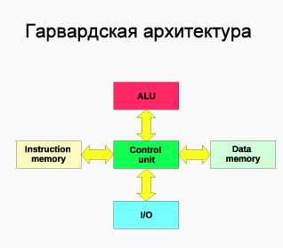
- 在哈佛架构中，中央设备是控制单元——计算机中的控制设备。所有其他计算机设备都连接到控制设备并通过它进行交互。指令存储器（指令存储器）、数据存储器（数据存储器）和输入输出设备在物理上相互分离。如上所述，这种架构不再以纯粹的形式使用，而是代码和数据物理分离的思想结果证明对于计算机和操作系统的功能子系统的开发非常有用。
- 在这种架构中，您不能通过尝试执行数据或将指令视为程序数据来破坏程序的逻辑
  
- 与哈佛相比，冯诺依曼架构包含共享内存中的所有内容。
- 如果不对程序本身的代码进行额外分析，就不可能确定单元格、数据或指令中的内容。同时，数据和指令的内存访问设备相同，简化了计算机的设计。 I/O 设备是单独分配的，它们位于处理器外部——结合了内存、ALU 和控制单元
- 基础计算机（Базовая ЭВМ）是冯诺依曼架构的典型例子

### 计算机基本结构

  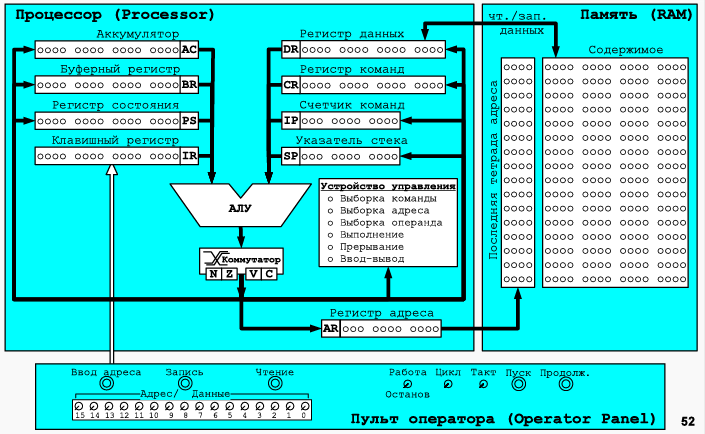
- 内存 - 由 2048 个单元组成。每个单元占用 16 位。读取数据和写入数据是通过连接到存储单元的总线实现的。内存访问有两个寄存器：
  - 和位地址寄存器（AR - Address Register），访问内存前需要在其中放置地址
  - 16 位数据寄存器（DR - Data Register），设计用于从存储单元读取或写入数据
- 算数逻辑单元（ALU - Arithmetic-n-Logic Unit）
  - 可以执行多种运算：加法、逻辑乘法、求逆和加法。
  - 在“加法”操作期间，可能会超出位网格并形成溢出位和进位位。 ALU 的输出通过开关连接到总线，通过总线可以将信息传输到计算机的任何其他寄存器
- 寄存器
  - IR（Input Register）是计算机操作员控制台的一部分，用于输入程序地址、程序代码和数据、运行程序以执行和控制计算机的操作模式
  - PS（Program State）状态寄存器，16位，存储控制计算机操作（操作、中断等）的位和结果的特征
  - IP（Instruction Pointer）指令指针，11 位，存储下一条命令的地址
  - CR（Command Register）命令寄存器，存储下一条命令的内容
  - AR（Address Register）地址寄存器，访问命令前再此存放命令地址
  - DR（Data Register）数据寄存器，用于从储存但愿读取或写入数据
  - SP（Stack Pointer）栈指针，11位，总是指向栈顶
  - BR（Buffer Register）缓冲寄存器，16位，用于存储运算过程中的临时数据
  - AC（Accumulator）
  - NZVC
    - N - 负数符号位
    - Z - 0 符号位
    - V - 溢出位
    - C - 最高进位借位
- 控制装置
  - MПУ（MCU - Microprogram Control Unit）微程序控制单元，最简单的计算机，其程序直接由微操作组成——即一步一步改变指定单元操作的BEVM门的值：ALU中的计算，寄存器之间的数据传输和简单的检查，MCU 的程序代码称为微码
  - MCU执行计算机的所有机器命令。 MPU中机器指令的执行称为指令周期。命令周期在逻辑上分为五个周期
    - 命令获取周期（Instruction Fetch）。将可执行指令加载到指令寄存器中并对其进行部分解码。将为每个可执行命令执行 
    - 地址获取周期（Address Fetch）。设计用于处理地址命令并获取操作数的地址，同时考虑到寻址模式。
    - 操作数获取周期（Operand Fetch）。对于那些必要的指令，将指令的第二个操作数放在 DR 中。首先要记住的是电池。
    - 执行周期（Execution）。正在执行命令。
    - 中断周期（Interrupt）。如果中断被启用并且 I/O 设备已准备好被交换（即，需要中断 - 将在后面讨论），则执行循环
  - 为了确保 BEVM 算子的运行，它提供了一个微程序实现
控制台操作周期：
    - 地址输入——来自密钥寄存器的地址被输入到程序计数器中
    - 读取——IP 中的地址信息从DR 的内存中读取，IP 加1
    - 写入- 来自IR 的信息被写入EP 中地址的内存，IP 加1。用于在操作员模式下输入程序和数据
    - 开始- 重置计算机的状态并切换到程序的执行
  - 此外，在操作面板上，还有其他控件 - “工作/停止”开关，它会导致程序在每个命令后停止； “Tact”开关，可以一次执行微码，“继续”按钮 - 恢复停止的计算机的操作
- 解码器
    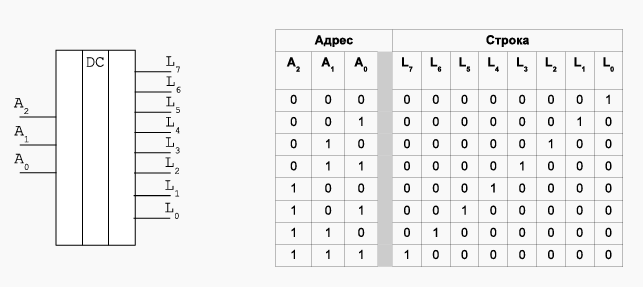
  - 解码器是一种设备，它的输入端提供一个数字代码，在输出端只选择一条输出线，其数量对应于解码器输入端的代码。
  - 最简单情况下的存储器框图由地址解码器和存储器元件组成。 让我们看看解码器是如何工作的
  - 幻灯片显示了解码器的示意图及其实现的真值表。 在存储器电路中，解码器用于在解码器的输入端选择对应于所需地址（代码）的存储器串
- 内存
    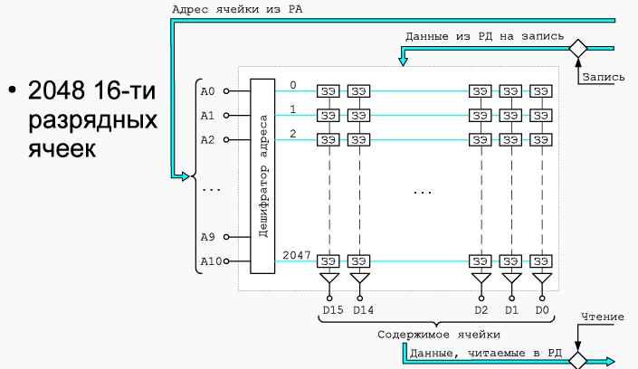
  - 基础计算机的内存是可寻址（或也称为可寻址）内存。可寻址存储器选择与地址码对应的单元之一，并使用该选择的单元执行存储器操作（读取或写入）
  - 为了读取或写入存储单元，您需要知道单元的地址
  - 高位地址总线从地址寄存器接收地址，进入地址译码器。在解码器的输出端，其中一条线被激活，在这条线上有几个存储元件，元件的数量对应于存储容量。之后，一个信号来进行必要的操作，负责将数据写入内存或从内存读取数据寄存器的电路部分被激活
  - 计算机中有 2048 个 16 位可寻址存储单元。我们记得，地址是 11 位。$2^{11}=2048$
- 算数逻辑单元（ALU）
    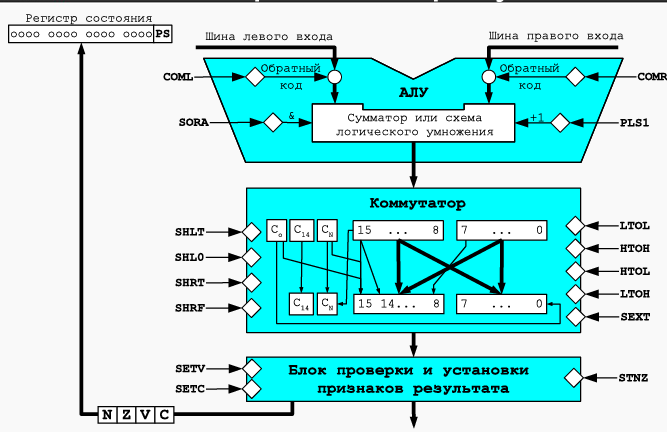
  - ALU 有两个输入—— 左和右。在 ALU 的每个输入端都有一个反相器 - 到达输入端的信号的逐位反相电路。这些方案允许您获取到达给定输入的二进制数 ALU 的反码。在反码中（下面讨论），将 1 逐位替换为 0，反之亦然
  - ALU 的主要部分由加法器或逻辑乘法电路组成。使用门 SORA (Sum OR And) 来选择操作。如果其输入为 1，则将执行 ALU 的左右输入的按位逻辑乘法，在相反的情况下，将操作数相加，同时考虑输入进位和输出进位的形成。加法器或逻辑乘法电路直接连接到换向器

### 微机指令
  
- 指令
  - 地址命令：MCU通过分析命令码的高四位来选择其中一种命令类型，称为操作码（简称CPC），地址命令旨在使用各种类型的寻址来执行计算机操作。所有 12 个寻址位一起构成了地址部分
    
  - 分类
    1. 使用直接绝对寻址 - 这些命令的第 11 位始终为 0，在地址部分（第 0 位到第 10 位）写入内存中操作数的地址值.执行操作时，指令通过选择或写入操作数直接访问给定地址
    2. 相对寻址 - 第 11 位为 1，第 8-10 位为寻址方式。位 0-7 包含一个偏移量，用于通过将偏移量添加到 IP 值来计算内存中操作数的地址。偏移量可以是正数或负数，允许寻址当前存储器指令之前的 127 个单元和之后的 128 个单元。我们强调偏移量 0 将指向命令后面的单元格。寻址模式可以是：
      - 直接相对（直接相对于 IP 的偏移）
      - 间接亲属
      - 间接自动增量
      - 间接自动递减
      - 相对于SP 的偏移量
    3. 将操作数直接（直接）加载到累加器中。对于这种格式，位 8-11 设置为单位。直接加载地址指令使用指令的 0-7 位中的数字作为操作数
    
      指令码 | 助记符 | 作用
      ------|--------|----
      2XXX | AND M | M&AC->AC
      3XXX | OR M | \^(\^M&\^AC)->AC
      4XXX | ADD M | M+AC->AC
      5XXX | ADC M | M+AC+C->AC
      6XXX | SUB M | AC-M->AC
      7XXX | CMP M | 同 SUB M 只是计算结果不存进 AC 只改变标识符
      8XXX | LOOP M | M-1->M IF M<=0 IP+1->IP
      9XXX |       | 
      AXXX | LD M | M->AC
      BXXX | SWAM M | M<->AC
      CXXX | JUMP M | M->IP
      DXXX | CALL M | SP-1->SP IP->SP M->IP
      EXXX | ST M | AC->M
      
  - 非寻址指令
      
    - 此类型旨在对不包含内存位置地址的指令进行编码以指定操作数或跳转。操作码始终为 0000
    - 其余位是操作码的扩展，允许您实现其他未寻址的命令
    - 分类
      - 输入/输出命令。它们由三部分组成：操作码（始终设置为 0001）、I/O 指令（设备标志的输入、输出、检查和复位）和 8 位 I/O 设备地址。 8 个地址位允许最多寻址 256 个设备，I / O 命令用于与处理器与外部设备进行交互，这些外部设备能够以人类方便和熟悉的形式存储和呈现信息
      - 分支命令用于根据给定条件组织转换。例如，如果算术运算的结果是负数，那么 BMI (Branch if Minus) 指令将跳转到相对于指令当前位置的偏移量指定的地址（跳转地址计算为指令中的偏移量和当前指令计数器）。这种命令1111的CPC，在扩展CPC的比特中，转换条件被编码
       
        指令码 | 助记符 | 作用
        ------|--------|----
        0000 | NOP | 
        0100 | HLT | 终止
        0200 | CLA | 0->AC
        0280 | NOT | \^AC->AC
        0300 | CLC | 0->C
        0380 | CMC | \^C->C
        0400 | ROL | 循环左移
        0480 | ROR | 循环右移
        0500 | ASL | 算数左移
        0580 | ASR | 算数右移
        0600 | SXTB | 延长符号位
        0680 | SWAB | 交换高低字节
        0700 | INC | AC+1->AC
        0780 | DEC | AC-1->AC
        0800 | NEG | \^AC+1->AC
        0900 | |
        0A00 | |
        0B00 | |
        0D00 | |
        0E00 | |

## 信息的表示

- 数字的表示
  - 定点数的表示
  - 无符号整数的表示
  - 有符号整数的表示
  - 有符号数的补码表示
  - 计算机得到补码数原理
  - Carry 与 Overflow
  - 浮点数的表示
  - 逻辑信息的表示
- 取值范围计算
  - 逻辑运算
    - 范围任取
  - 算数运算
    - 加法（A+B）
      1. 情况1  
        $$-2^{14}<=A,B<=2^{14}
        $$
      2. 情况2
        $$-2^{15}<=A<=0\\
        2^{14}<=B<=2^{15}-1\\
        $$
      4. 情况3
        $$0<=A<=2^{15}-1\\
        -2^{15}<=B<=-2^{14}-1\\
        $$
      - 减法（A-B）
        - 算法同加法，将-B当作B即可
- 字符的表示
  - ASCII码
  - ISO8859-5 (ГОСТ-основная)
  - WIN1251
  - UNICODE, UTF-8
- 行的表示
